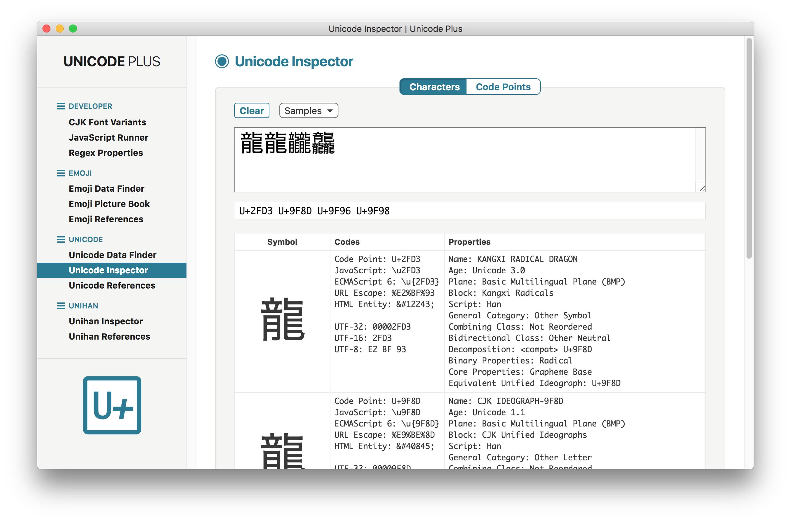
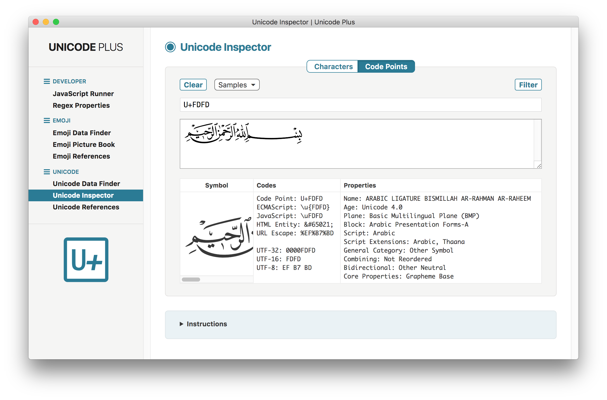

#  UNICODE PLUS

**Unicode Plus** is a set of Unicode, Unihan & emoji utilities wrapped into one single app, built with [Electron](https://electronjs.org).

This app works on Mac OS X, Linux and Windows operating systems.

## Utilities

The following utilities are currently available:

* [CJK Font Variants](#cjk-font-variants)
* [JavaScript Runner](#javascript-runner)
* [Regex Properties](#regex-properties)
* [Emoji Data Finder](#emoji-data-finder)
    * [Find by Name](#find-by-name)
    * [Match Symbol](#match-symbol)
    * [Filter Text](#filter-text)
* [Emoji Picture Book](#emoji-picture-book)
* [Emoji References](#emoji-references)
* [Unicode Data Finder](#unicode-data-finder)
    * [Find by Name](#find-by-name-1)
    * [Match Symbol](#match-symbol-1)
    * [List by Block](#list-by-block)
* [Unicode Inspector](#unicode-inspector)
* [Unicode References](#unicode-references)
* [Unihan Inspector](#unihan-inspector)
* [Unihan References](#unihan-references)

## CJK Font Variants

- The **CJK Font Variants** utility displays simultaneously any string of Unihan characters in four different CJK (Chinese/Japanese/Korean) typefaces:
    - Chinese (Simplified)
    - Chinese (Traditional)
    - Japanese
    - Korean
- The typefaces belong to the open-source set of [Google Noto CJK Fonts](https://www.google.com/get/noto/help/cjk/):
    - Noto Sans CJK SC Regular
    - Noto Sans CJK TC Regular
    - Noto Sans CJK JP Regular
    - Noto Sans CJK KR Regular
- Additionally, it is possible to specify a set of logographic glyph variants for display by using the <kbd>East Asian Glyphs</kbd> popup menu.
- Various samples are provided; some of them make use of the information found in the [StandardizedVariants.txt](https://www.unicode.org/Public/UNIDATA/StandardizedVariants.txt) data file, or in the [IVD_Sequences.txt](https://www.unicode.org/ivd/data/2017-12-12/IVD_Sequences.txt) data file.


## JavaScript Runner

- The **JavaScript Runner** utility lets you execute JavaScript code, and comes with several sample scripts related to Unicode, Unihan and emoji; it is useful for quick testing/prototyping or data processing.


## Regex Properties

- The **Regex Properties** utility displays all the Unicode properties available in this app for regular expressions, used in particular by the **Emoji Data Finder** and **Unicode Data Finder** utilities.
- These properties are suitable to build Unicode-aware regular expressions in JavaScript (ECMAScript 6) using the 'u' flag.
- Unicode properties fall into four groups, which can be displayed individually using the <kbd>Category</kbd> pop-up menu:
    - **General Category** properties
    - **Binary** properties
    - **Script** properties
    - **Script Extensions** properties
- For **General Category** properties, prefixing with `General_Category=` (Canonical) or `gc=` (Alias) is optional. Use the <kbd>Optional Prefix</kbd> checkbox to control whether the prefix is included or not.
- Groupings:

    | Property | Description |
    | -------- | ----------- |
    | Cased_Letter | Uppercase_Letter \| Lowercase_Letter \| Titlecase_Letter |
    | Letter | Uppercase_Letter \| Lowercase_Letter \| Titlecase_Letter \| Modifier_Letter \| Other_Letter |
    | Mark | Nonspacing_Mark \| Spacing_Mark \| Enclosing_Mark |
    | Number | Decimal_Number \| Letter_Number \| Other_Number |
    | Punctuation | Connector_Punctuation \| Dash_Punctuation \| Open_Punctuation \| Close_Punctuation \| Initial_Punctuation \| Final_Punctuation \| Other_Punctuation |
    | Symbol | Math_Symbol \| Currency_Symbol \| Modifier_Symbol \| Other_Symbol |
    | Separator | Space_Separator \| Line_Separator \| Paragraph_Separator |
    | Other | Control \| Format \| Surrogate \| Private_Use \| Unassigned |

- `\P{…}` is the negated form of `\p{…}`. Use the <kbd>Negated</kbd> checkbox to toggle between the two forms.
- Notes:
    - `\p{Any}` is equivalent to `[\u{0}-\u{10FFFF}]`
    - `\p{ASCII}` is equivalent to `[\u{0}-\u{7F}]`
    - `\p{Assigned}` is equivalent to `\P{Unassigned}`
- Information pertaining to this list has been gathered from several sources (see References), and slightly refined through trial and error.


## Emoji Data Finder

### Find by Name

- The **Find by Name** feature of the **Emoji Data Finder** utility displays a list of basic data (symbol, short name, keywords, code) of matching Unicode emoji searched by name or keyword, including through regular expressions.
- After entering a query, clicking the <kbd>Search</kbd> button will display a list of all relevant matches, if any.
- *Fully-qualified* (keyboard/palette) emoji are presented in a standard way, while *non-fully-qualified* (display/process) emoji are shown in a distinctive muted (grayed out) style.
- This feature deals with the 3570 emoji defined in the **Emoji 11.0** version of the [emoji-test.txt](https://www.unicode.org/Public/emoji/11.0/emoji-test.txt) data file; the 12 keycap bases and the 26 singleton Regional Indicator characters are not included.
- Various examples of regular expressions are provided for quick copy-and-paste.


### Match Symbol

- The **Match Symbol** feature of the **Emoji Data Finder** utility displays a list of basic data (symbol, short name, keywords, code) of Unicode emoji matching a symbol, or a regular expression using Unicode properties.
- After entering a query, clicking the <kbd>Search</kbd> button will display a list of all relevant matches, if any.
- *Fully-qualified* (keyboard/palette) emoji are presented in a standard way, while *non-fully-qualified* (display/process) emoji are shown in a distinctive muted (grayed out) style.
- This feature deals with the 3570 emoji defined in the **Emoji 11.0** version of the [emoji-test.txt](https://www.unicode.org/Public/emoji/11.0/emoji-test.txt) data file; the 12 keycap bases and the 26 singleton Regional Indicator characters are not included.
- Various examples of regular expressions are provided for quick copy-and-paste.


### Filter Text

- The **Filter Text** feature of the **Emoji Data Finder** utility displays in real time a list of basic data (symbol, short name, keywords, code) of all the Unicode emoji contained in a text string.
- Text can by directly typed or pasted from the clipboard into the main input field. Clicking on the <kbd>Filter</kbd> button strips out all non-emoji characters.
- It is also possible to input predefined sets of emoji selected from the <kbd>Samples&nbsp;▾</kbd> pop-up menu.
- As a convenience, the input field can be emptied using the <kbd>Clear</kbd> button.
- *Fully-qualified* (keyboard/palette) emoji are presented in a standard way, while *non-fully-qualified* (display/process) emoji are shown in a distinctive muted (grayed out) style.
- This feature deals with the 3570 emoji defined in the **Emoji 11.0** version of the [emoji-test.txt](https://www.unicode.org/Public/emoji/11.0/emoji-test.txt) data file; the 12 keycap bases and the 26 singleton Regional Indicator characters are not included.


## Emoji Picture Book

- The **Emoji Picture Book** utility displays lists of Unicode emoji in a picture book fashion.
- Any group of pictures can be displayed by selecting its name in the category pop-up menu, among:<br>"Smileys & People", "Animals & Nature", "Food & Drink", "Travel & Places", "Activities", "Objects", "Symbols", "Flags".
- The size of all emoji pictures (from 32 to 128&nbsp;pixels) can be adjusted by moving the dedicated slider left and right.
- The groups and subgroups of emoji are those defined in the **Emoji 11.0** version of the [emoji-test.txt](https://www.unicode.org/Public/emoji/11.0/emoji-test.txt) data file; the 12 keycap bases and the 26 singleton Regional Indicator characters are not included.
- Only the 2789 *fully-qualified* (keyboard/palette) encodings of the emoji are used unless they cannot be displayed properly, depending on the emoji support level of the operating system.
- Emoji failing to be represented as proper pictures are purely and simply discarded.


## Emoji References

- The **Emoji References** utility provides a list of reference links to emoji-related web pages.


## Unicode Data Finder

### Find by Name

- The **Find by Name** feature of the **Unicode Data Finder** utility displays a list of basic data (symbol, code point, name, block) of matching Unicode characters searched by name (or alias name), including through regular expressions.
- After entering a query, clicking the <kbd>Search</kbd> button will display a list of all relevant matches, if any, ordered by code point value.
- When available, name aliases are also displayed (in smaller typeface) after the unique and immutable Unicode name. A correction alias is indicated by a leading reference mark `※`.
- It is possible to choose how many characters are shown one page at a time.
- The search is performed on the 276955 assigned characters (or code points) defined in the **Unicode 11.0** version of the [UnicodeData.txt](https://www.unicode.org/Public/UNIDATA/UnicodeData.txt) data file.
- Various examples of regular expressions are provided for quick copy-and-paste.


### Match Symbol

- The **Match Symbol** feature of the **Unicode Data Finder** utility displays a list of basic data (symbol, code point, name, block) of Unicode characters matching a symbol, or a regular expression using Unicode properties.
- After entering a query, clicking the <kbd>Search</kbd> button will display a list of all relevant matches, if any, ordered by code point value.
- It is possible to choose how many characters are shown one page at a time.
- The search is performed on the 276955 assigned characters (or code points) defined in the **Unicode 11.0** version of the [UnicodeData.txt](https://www.unicode.org/Public/UNIDATA/UnicodeData.txt) data file.
- Various examples of regular expressions are provided for quick copy-and-paste.


### List by Block

- The **List by Block** feature of the **Unicode Data Finder** utility displays in real time a list of basic data (symbol, code point, name, block) of Unicode characters belonging to the same block range.
- It is possible to choose how many characters are shown one page at a time.
- A block can be selected either by <kbd>Block Range</kbd> or by <kbd>Block Name</kbd>, as defined in the **Unicode 11.0** version of the [Blocks.txt](https://www.unicode.org/Public/UNIDATA/Blocks.txt) data file.
- It is also possible to directly enter a code point (or character) in the <kbd>Specimen</kbd> field, then click on the <kbd>Go</kbd> button to automatically select the block containing the code point, scroll its basic data into view, and highlight its hexadecimal code value.


## Unicode Inspector

- The **Unicode Inspector** utility displays code point information in real time for each Unicode character of a text string.
- Characters can be entered either directly in the "Characters" input field, or using a series of code points in hexadecimal format in the "Code Points" input field.
- It is also possible to input predefined sets of characters selected from each <kbd>Samples&nbsp;▾</kbd> pop-up menu.
- As a convenience, each input field can be emptied using the <kbd>Clear</kbd> button.
- In output, the standard Unicode code point format `U+0041` is used, i.e. "U+" directly followed by 4 or 5 hex digits.
- In input, more hexadecimal formats are allowed, including Unicode escape sequences, such as `\u611B` and `\u{1F49C}`. Clicking on the <kbd>Filter</kbd> button converts all valid codes to standard Unicode code point format.
- Information is provided for the 276955 assigned characters (or code points) defined in the **Unicode 11.0** version of the [UnicodeData.txt](https://www.unicode.org/Public/UNIDATA/UnicodeData.txt) data file.
- Extra information is also obtained from the following data files:
    - [Blocks.txt](https://www.unicode.org/Public/UNIDATA/Blocks.txt)
    - [DerivedAge.txt](https://www.unicode.org/Public/UNIDATA/DerivedAge.txt)
    - [DerivedCoreProperties.txt](https://www.unicode.org/Public/UNIDATA/DerivedCoreProperties.txt)
    - [EquivalentUnifiedIdeograph.txt](https://www.unicode.org/Public/UNIDATA/EquivalentUnifiedIdeograph.txt)
    - [NameAliases.txt](https://www.unicode.org/Public/UNIDATA/NameAliases.txt)
    - [PropList.txt](https://www.unicode.org/Public/UNIDATA/PropList.txt)
    - [Scripts.txt](https://www.unicode.org/Public/UNIDATA/Scripts.txt)
    - [ScriptExtensions.txt](https://www.unicode.org/Public/UNIDATA/ScriptExtensions.txt)





## Unicode References

- The **Unicode References** utility provides a list of reference links to Unicode-related web pages.


## Unihan Inspector

- The **Unihan Inspector** utility displays all available properties for each of the 88889 Unihan characters defined in  the set of data files contained in the [Unihan.zip](https://www.unicode.org/Public/UNIDATA/Unihan.zip) archive file:
    - *Unihan_DictionaryIndices.txt*
    - *Unihan_DictionaryLikeData.txt*
    - *Unihan_IRGSources.txt*
    - *Unihan_NumericValues.txt*
    - *Unihan_OtherMappings.txt*
    - *Unihan_RadicalStrokeCounts.txt*
    - *Unihan_Readings.txt*
    - *Unihan_Variants.txt*
- Any Unihan character can be entered in the input field either as a code point or a character.
- It is also possible to randomly enter a code point by clicking on the <kbd>Random</kbd> button.
- The selected Unihan character will be displayed in a large font, followed by its code point; clicking on the gray button below it will step through four different CJK typefaces, among: `SC` (Simplified Chinese), `TC` (Traditional Chinese), `JP` (Japanese) and `KR` (Korean).
- Use the <kbd>Categories</kbd> checkbox to toggle between: all properties ordered alphabetically, or grouped by categories.
- In addition, the utility provides, for each Unihan character: basic Unicode information, as well as radical, number of strokes, definition, variant characters, when available.
- Notes:
    - The Kangxi Radical field uses extra information from the [CJKRadicals.txt](https://www.unicode.org/Public/UNIDATA/CJKRadicals.txt) data file.
    - The Yasuoka Variants information comes directly from the "Variants table for Unicode" data file [UniVariants.txt](http://kanji.zinbun.kyoto-u.ac.jp/~yasuoka/ftp/CJKtable/UniVariants.Z) provided by Prof. [Kōichi Yasuoka](http://kanji.zinbun.kyoto-u.ac.jp/~yasuoka/).


## Unihan References

- The **Unihan References** utility provides a list of reference links to Unihan-related web pages.


## Building

You'll need [Node.js](https://nodejs.org) installed on your computer in order to build this app.

```bash
git clone https://github.com/tonton-pixel/unicode-plus
cd unicode-plus
npm install
npm start
```

If you don't wish to clone, you can [download the source code](https://github.com/tonton-pixel/unicode-plus/archive/master.zip).

Several scripts are also defined in the `package.json` file to build OS-specific bundles of the app, using the simple yet powerful [Electron Packager](https://github.com/electron-userland/electron-packager) Node module.\
For instance, running the following command will create a `Unicode Plus.app` version for Mac OS X:

```bash
npm run build-darwin
```

## Using

You can [download the latest release](https://github.com/tonton-pixel/unicode-plus/releases) for Mac OS X.

## License

The MIT License (MIT).

Copyright © 2018 Michel MARIANI.
