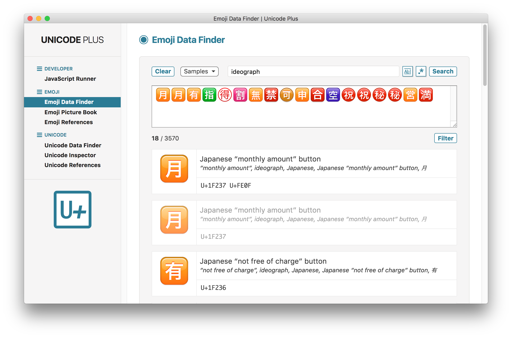
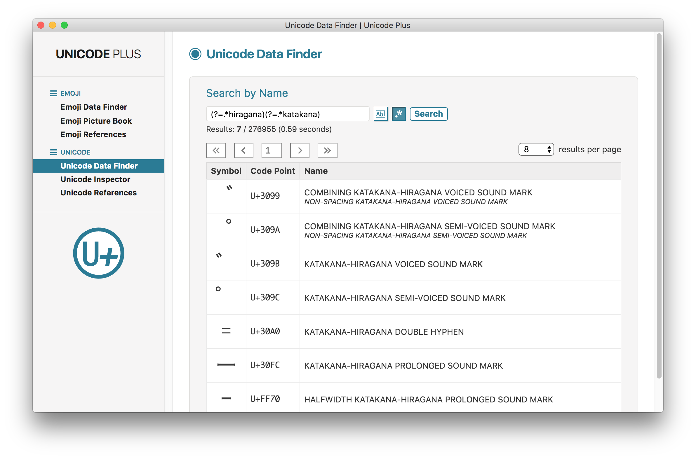

#  UNICODE PLUS

**Unicode Plus** is a set of Unicode & emoji utilities wrapped into one single app, built with [Electron](https://electron.atom.io).

This app works on Mac OS X, Linux and Windows operating systems.

## Utilities

The following utilities are currently available:

* [Emoji Data Finder](#emoji-data-finder)
* [Emoji Picture Book](#emoji-picture-book)
* [Emoji References](#emoji-references)
* [JavaScript Runner](#javascript-runner)
* [Unicode Data Finder](#unicode-data-finder)
* [Unicode Inspector](#unicode-inspector)
* [Unicode References](#unicode-references)

## Emoji Data Finder

- The **Emoji Data Finder** utility displays in real time a list of basic data (short name, keywords, code) of all the Unicode emoji characters contained in a text string.
- *Fully-qualified* (keyboard/palette) emoji are presented in a standard way, while *non-fully-qualified* (display/process) emoji are shown in a distinctive muted (grayed out) style.
- Text can by directly typed or pasted from the clipboard into the main input field. Clicking on the <kbd>Filter</kbd> button strips out all non-emoji characters.
- It is also possible to input predefined sets of emoji selected from the <kbd>Samples&nbsp;▾</kbd> pop-up menu.
- Alternatively, it is possible to search the entire list of emoji by name, keyword or symbol, including through regular expressions. After entering a query, clicking the <kbd>Search</kbd> button will copy all relevant matches, if any, into the input field.
- As a convenience, the input field can be emptied using the <kbd>Clear</kbd> button.
- This utility deals with the 3570 emoji defined in the **Emoji 11.0** version of the [emoji-test.txt](https://unicode.org/Public/emoji/11.0/emoji-test.txt) data file; the 12 keycap bases and the 26 singleton Regional Indicator characters are not included.



## Emoji Picture Book

- The **Emoji Picture Book** utility displays lists of Unicode emoji characters in a picture book fashion.
- Any group of pictures can be displayed by selecting its name in the category pop-up menu, among:<br>"Smileys & People", "Animals & Nature", "Food & Drink", "Travel & Places", "Activities", "Objects", "Symbols", "Flags".
- The size of all emoji pictures (from 32 to 128&nbsp;pixels) can be adjusted by moving the dedicated slider left and right.
- The groups and subgroups of emoji are those defined in the **Emoji 11.0** version of the [emoji-test.txt](https://unicode.org/Public/emoji/11.0/emoji-test.txt) data file; the 12 keycap bases and the 26 singleton Regional Indicator characters are not included.
- Only the 2789 *fully-qualified* (keyboard/palette) encodings of the emoji are used unless they cannot be displayed properly, depending on the emoji support level of the operating system.
- Emoji failing to be represented as proper pictures are purely and simply discarded.


## Emoji References

- The **Emoji References** utility provides a list of reference links to emoji-related web pages.


## JavaScript Runner

- The **JavaScript Runner** utility lets you execute JavaScript code, and comes with several sample scripts related to Unicode and emoji; it is useful for quick testing/prototyping or data processing.


## Unicode Data Finder

- The **Unicode Data Finder** utility displays a list of basic data (symbol, code point, name) of matching Unicode characters searched by name (or alias name), including through regular expressions.
- After entering a query, clicking the <kbd>Search</kbd> button will display a list of all relevant matches, if any, ordered by code point value.
- It is possible to choose how many results are shown one page at a time.
- When available, name aliases are also displayed (in smaller typeface) after the unique and immutable Unicode name. A correction alias is indicated by a trailing asterisk.
- The search is performed on the 276955 characters (or code points) defined in the **Unicode 11.0** version of the [UnicodeData.txt](https://www.unicode.org/Public/UNIDATA/UnicodeData.txt) data file.



## Unicode Inspector

- The **Unicode Inspector** utility displays code point information in real time for each Unicode character of a text string.
- Characters can be entered either directly in the "Characters" input field, or using a series of code points in hexadecimal format in the "Code Points" input field.
- It is also possible to input predefined sets of characters selected from each <kbd>Samples&nbsp;▾</kbd> pop-up menu.
- As a convenience, each input field can be emptied using the <kbd>Clear</kbd> button.
- In output, the standard Unicode code point format `U+0041` is used, i.e. "U+" directly followed by 4 or 5 hex digits.
- In input, more hexadecimal formats are allowed, including Unicode escape sequences, such as `\u611B` and `\u{1F49C}`. Clicking on the <kbd>Filter</kbd> button converts all valid codes to standard Unicode code point format.
- Information is provided for the 276955 characters (or code points) defined in the **Unicode 11.0** version of the [UnicodeData.txt](https://www.unicode.org/Public/UNIDATA/UnicodeData.txt) data file.
- Extra information is also obtained from the [Blocks.txt](https://www.unicode.org/Public/UNIDATA/Blocks.txt), [DerivedAge.txt](https://www.unicode.org/Public/UNIDATA/DerivedAge.txt), [NameAliases.txt](https://www.unicode.org/Public/UNIDATA/NameAliases.txt), [PropList.txt](https://www.unicode.org/Public/UNIDATA/PropList.txt) data files.


## Unicode References

- The **Unicode References** utility provides a list of reference links to Unicode-related web pages.


## Building

You'll need [Node.js](https://nodejs.org) installed on your computer in order to build this app.

```bash
git clone https://github.com/tonton-pixel/unicode-plus
cd unicode-plus
npm install
npm start
```

If you don't wish to clone, you can [download the source code](https://github.com/tonton-pixel/unicode-plus/archive/master.zip).

Several scripts are also defined in the `package.json` file to build OS-specific bundles of the app, using the simple yet powerful [Electron Packager](https://github.com/electron-userland/electron-packager) Node module.\
For instance, running the following command will create a `Unicode Plus.app` version for Mac OS X:

```bash
npm run build-darwin
```

## Using

You can [download the latest release](https://github.com/tonton-pixel/unicode-plus/releases) for Mac OS X.

## License

The MIT License (MIT).

Copyright © 2018 Michel MARIANI.
